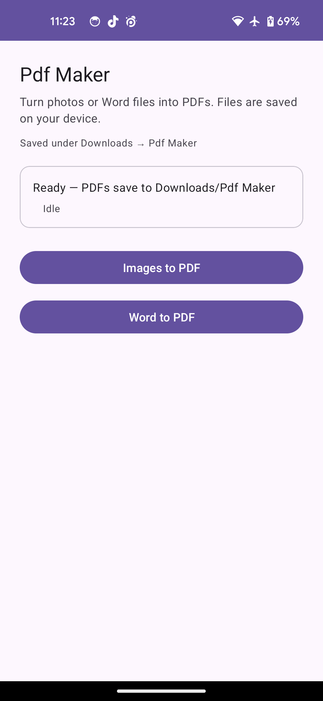

# Pdf Maker

Android app to create PDFs on your device from **photos** or **Microsoft Word** files (`.doc` / `.docx`). Nothing is uploaded to a server—conversion runs locally.

## Screenshot



## Features

- **Images to PDF** — Pick one or more images; each becomes page content in a single PDF (scaled to fit the page).
- **Word to PDF** — Pick a Word document and export it as PDF.
- **Output** — Files are saved under **Downloads → Pdf Maker** (folder name: `Pdf Maker`).

## Tech stack

- Kotlin, Material 3, View Binding  
- [iText 7](https://itextpdf.com/) for image → PDF  
- [Aspose.Words for Java](https://products.aspose.com/words/android-java/) for Word → PDF  

## Requirements

- **minSdk** 24 · **targetSdk** 36  
- **JDK** 17  

## Build

```bash
./gradlew assembleDebug
```

Output APK: `app/build/outputs/apk/debug/`

## Permissions

- **Android 10 (API 29) and above:** No storage permission required for saving to Downloads via the system media store.
- **Older devices:** `WRITE_EXTERNAL_STORAGE` (declared with `maxSdkVersion="28"`) may be requested when saving to the public Downloads folder.

## License

Third-party libraries (iText, Aspose) have their own licensing terms; configure Aspose as needed for production use.
