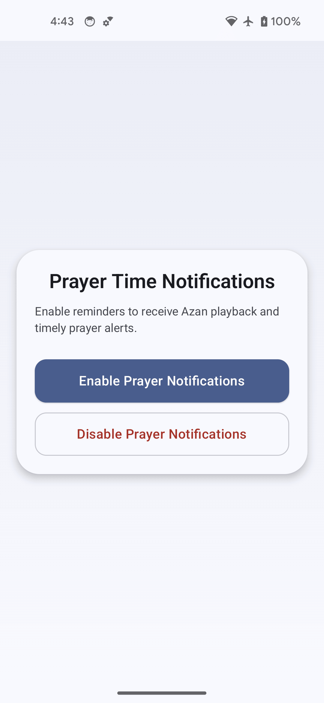

# PrayerNotification (Android)

Lightweight Kotlin + Compose sample that schedules prayer notifications with `AlarmManager` and automatically chains the next prayer alarm.

## Features

- Exact alarm scheduling via `setExactAndAllowWhileIdle`
- Runtime permission handling:
  - `POST_NOTIFICATIONS` (Android 13+)
  - exact alarm capability check (Android 12+)
- Auto re-schedule on:
  - alarm trigger
  - reboot
  - date/timezone/time change
- Foreground-service Azan playback support
- Simple Compose UI (Enable / Disable notifications)

## Project Structure

- `app` - sample app (UI, scheduler, receivers, service)
- `feature-prayertime` - prayer time calculation/data source module

## Screenshots

Create/replace these files in `screenshots/`:

- `screenshots/home-screen.png`
- `screenshots/demo.gif`

### App Screenshot

### Demo GIF

## Run

1. Open in Android Studio / Cursor.
2. Build and run `app` module.
3. Tap **Enable Prayer Notifications**.
4. Grant permissions when prompted.

## Notes

- The app currently depends on `feature-prayertime` minSdk, so effective minSdk follows that module.
- For Azan playback, add an audio file in:
  - `app/src/main/res/raw/azan.mp3`
