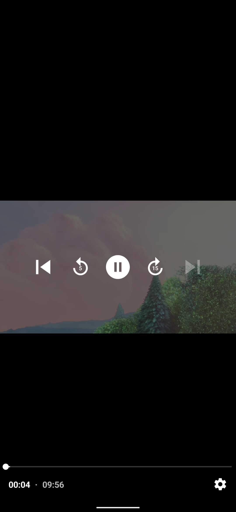

# SwipeExoPlayer

Android sample showing a vertical, reels-style video feed using `ViewPager2` + `Media3 ExoPlayer` + `ViewModel` state restoration.

## Features
- Vertical swipe experience with `ViewPager2` and `FragmentStateAdapter`
- `Media3 ExoPlayer` playback inside each page fragment
- Playback position persistence per item via shared `ViewModel`
- Lifecycle-safe player handling (`resume`, `pause`, `release`)
- Simple local data source for quick customization

## Tech Stack
- Kotlin
- AndroidX ViewPager2 + Fragments
- AndroidX Lifecycle ViewModel
- AndroidX Media3 ExoPlayer + UI

## Demo Assets
Scrolling Experience



Video Playback
 
 https://github.com/user-attachments/assets/ab7144da-9d9e-4cd2-aa5b-88713379d5cc

## Project Structure
```text
SwipeExoPlayer/
  app/src/main/java/com/sohaib/swipeexoplayer/
    MainActivity.kt                      # Hosts ViewPager2
    adapters/PagerAdapterVideo.kt        # FragmentStateAdapter
    fragments/FragmentVideo.kt           # Player page
    viewModels/ViewModelMain.kt          # Playback state map (position -> time)
    viewModels/ViewModelVideo.kt         # ExoPlayer setup and lifecycle
    data/DataSourceVideos.kt             # Sample remote MP4 list
```

## How It Works
1. `MainActivity` fetches URLs from `DataSourceVideos` and wires the pager adapter.
2. Each page creates `FragmentVideo` with URL + adapter position.
3. `FragmentVideo` reads saved playback time from `ViewModelMain`.
4. `ViewModelVideo` initializes ExoPlayer, seeks to the stored position, and exposes it with LiveData.
5. On pause, fragment stores current playback position; on destroy, player is released.

## Setup
1. Clone the monorepo:
   ```bash
   git clone https://github.com/SohaibAhmed/androidlibraries.git
   ```
2. Open `SwipeExoPlayer` in Android Studio.
3. Sync Gradle and run on an emulator/device (API 24+ recommended).

## Customize Video List
Update URLs in:
- `app/src/main/java/com/sohaib/swipeexoplayer/data/DataSourceVideos.kt`

You can replace sample URLs with your own CDN/backend endpoints.

## Notes
- Internet permission is required because videos stream from remote URLs.
- This project is intended as a learning/sample implementation.

## Support
If this project helps you, please give it a star on GitHub. It helps others discover the project and supports future improvements.

